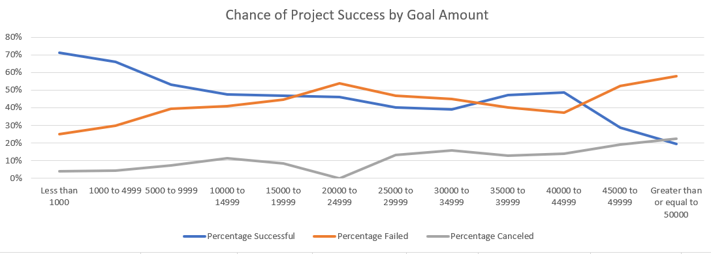

# Homework1

<h1>Excel Wrangling</h1>

In this exercise, using the Excel table provided, modify and analyze the data of 4,000 past Kickstarter projects as you attempt to uncover some market trends. Also, answer the following questions about the data.

<h3>1.	Given the provided data, what are three conclusions we can draw about Kickstarter campaigns?</h3>

Based on the data given, we can conclude that the higher the Goal Amount, the higher the chance of project failure. Project success significantly drops as Goal Amount increases, while Project Cancelation and Project Failure rates remain steady or slightly increase as Goal Amount increases. We can also conclude that Project success, failure, and cancelation are not significantly different when launched during certain months of the year.

<h3>2.	What are some limitations of this dataset?</h3>

This dataset is limited in the predictions it can make about any future or unknown projects started on this specific KickStarter service. No examined correlations are strong enough to predict any specific project’s fate, especially as the Goal Amounts increase upwards of $50000USD.

<h3>3.	What are some other possible tables and/or graphs that we could create?</h3>

With the available dataset, we can also analyze any possible correlation between “Spotlight” status and project fate. This metric may be helpful in promoting, advertising, or improving the Spotlight feature on this KickStarter service. We can also determine in-set popularity of projects, based either on amount funded or number of backers, for any given month of the year to see if seasons affect certain categories or sub-categories. 
